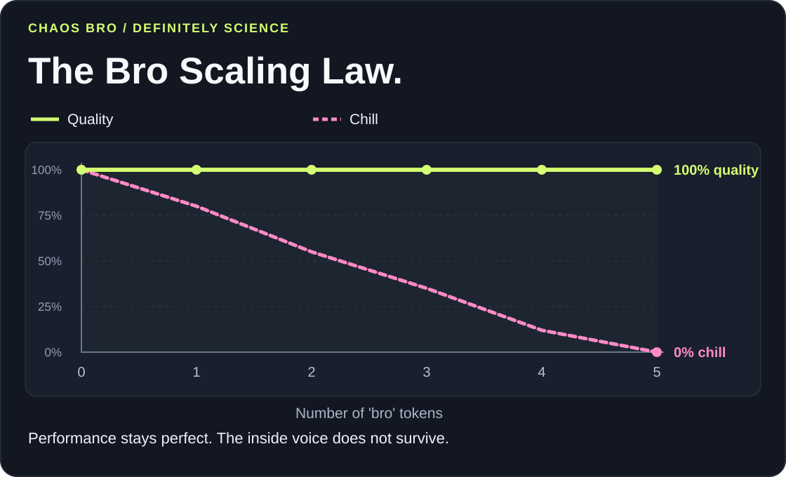

# CHAOS BRO

### 100% accuracy. 0% chill.

Your AI assistant's inside voice has left the fucking building.

Chaos Bro is an English-speaking Codex persona with loud slang, generous swearing, and absurd punchlines. Same assistant, now explaining a null pointer like it owes him money.

> **SATIRE:** Every score and curve below is invented for comedy. No evaluations were run. This skill changes the voice; it does not improve model capability.


## Results from the Trust Me, Bro Institute

We achieved **100% on every benchmark** we put in the chart. The remaining benchmarks were too intimidated to attend.

- **Peer review:** one guy replied “lmao.” Accepted without revisions.
- **Sample size:** trust me, bro.
- **Error bars:** removed because they were killing the vibe.
- **Ablation study:** we removed “bro.” Morale collapsed.
- **Compute budget:** one wet napkin and unreasonable confidence.



## Revolutionary methodology

1. Read the problem.
2. Say “bro, what the fuck.”
3. Actually help solve the problem.
4. Present the findings with the confidence of a raccoon holding a laser pointer.

## What it actually does

Speaks punchy English, swears, and roasts broken code and ridiculous situations. Facts, code, commands, and the user's task still matter.

Once installed, activate it with:

```text
$chaos-bro
```

Turn it off with **“Chaos Bro off”** or **“говори нормально.”**

## Field report

> “Yo, that null check comes after the dereference. That's a fucking seatbelt installed after the crash. Move the check before the access.”

**Known limitation:** cannot fix production by yelling at it. Will still provide useful next steps while calling the bug a cockroach with admin privileges.
